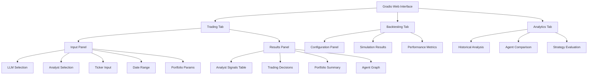

# Gradio UI Implementation Plan for AI Hedge Fund

## Overview

This plan outlines the implementation of a comprehensive Gradio-based web interface that provides all the functionality of the CLI version in a more user-friendly, visually appealing way. Gradio allows for rapid UI development with Python and seamless integration with the existing codebase.

## Core Features to Implement

Based on analysis of the codebase, the Gradio UI needs to support:

1. **Trading Module**
   - Select AI analysts (currently done via checkboxes in CLI)
   - Choose LLM model (via dropdown in CLI)
   - Enter ticker symbols
   - Set date ranges
   - Configure portfolio parameters (initial cash, margin)
   - View trading decisions and analyst signals
   - Display reasoning (optional)
   - Show agent graph (optional)

2. **Backtesting Module**
   - All features from the trading module
   - Run simulations over historical data periods
   - View performance metrics
   - Visualize portfolio performance over time
   - Compare different strategy combinations

## UI Architecture



## Implementation Details

### 1. File Structure

```
src/
├── gui/
│   ├── assets/           # CSS, images, etc.
│   ├── gradio_app.py     # Main Gradio application
│   ├── components.py     # Reusable UI components
│   └── utils.py          # Helper functions for the UI
```

### 2. Core Component Details

#### `gradio_app.py`
- Main entry point for the Gradio application
- Sets up the tabs and overall UI structure
- Connects UI elements to backend functions
- Handles state management

#### `components.py`
- Define reusable UI components:
  - Analyst selection checkboxes
  - Model selection dropdown
  - Results formatting functions
  - Chart generation components

#### `utils.py`
- Helper functions to bridge between UI and backend
- Data formatting for visualization
- Cache management for performance
- Error handling

### 3. UI Workflow

1. **Trading Flow**
   - User inputs ticker(s), dates, selects analysts and model
   - User clicks "Run Analysis" button
   - System executes the hedge fund algorithm
   - Results displayed as formatted tables and visualizations
   - Option to save/export results

2. **Backtesting Flow**
   - Similar initial inputs as trading
   - System runs simulation over historical period
   - Results displayed as performance metrics, tables, and charts
   - Interactive time-series visualization of portfolio performance

## Key UI Elements

### Trading Tab

1. **Input Section**
   - Text input for ticker symbols (comma-separated)
   - Date pickers for start/end dates
   - Number inputs for initial cash and margin
   - Checkboxes for analyst selection (styled similar to CLI)
   - Dropdown for LLM model selection
   - Toggle switches for additional options (show reasoning, agent graph)

2. **Results Section**
   - Color-coded tables showing analyst signals per ticker
   - Trading decision tables with action, quantity, confidence
   - Portfolio summary table
   - Agent reasoning text area (expandable/collapsible)
   - Agent graph visualization (if enabled)

### Backtesting Tab

1. **Input Section**
   - Same as Trading tab, with additional simulation parameters

2. **Results Section**
   - Interactive time series chart of portfolio value
   - Performance metrics dashboard (Sharpe ratio, Sortino ratio, Max drawdown, etc.)
   - Trade history table with color-coded actions
   - Signal distribution visualization

### Analytics Tab (Additional Enhancement)

1. **Comparative Analysis**
   - Compare performance of different analyst combinations
   - Compare different LLM models
   - Historical performance benchmarking

2. **Signal Analysis**
   - Visualize correlation between signals and performance
   - Track analyst accuracy over time

## Technical Implementation Approach

1. **Gradio Integration**
   - Create wrapper functions around the existing `run_hedge_fund` and `Backtester` classes
   - Use Gradio's reactive components to update the UI based on user input
   - Leverage Gradio's built-in visualization tools for charts

2. **Data Visualization**
   - Use Plotly for interactive charts
   - Create custom visualization functions for more complex displays
   - Ensure all visualizations are responsive and informative

3. **Performance Considerations**
   - Implement caching for expensive operations
   - Use asynchronous processing for long-running backtests
   - Add progress indicators for operations that take time

4. **Styling and UX**
   - Create a consistent color scheme matching the CLI version's colors
   - Design intuitive layouts that guide the user through the workflow
   - Add helpful tooltips and information buttons for complex features

## Implementation Timeline

1. **Phase 1: Core UI Framework**
   - Set up basic Gradio application structure
   - Implement tabs and layout
   - Create input components

2. **Phase 2: Trading Functionality**
   - Connect input components to trading functions
   - Implement results display
   - Add styling and interactivity

3. **Phase 3: Backtesting Functionality**
   - Implement backtesting UI components
   - Create visualization components
   - Connect to backtesting functions

4. **Phase 4: Analytics and Enhancements**
   - Add comparative analysis features
   - Implement additional visualizations
   - Optimize performance

5. **Phase 5: Testing and Refinement**
   - Test with various inputs and scenarios
   - Refine UI based on usability testing
   - Add final styling and polish